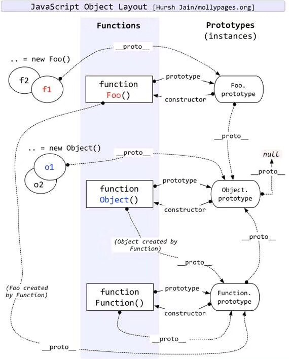
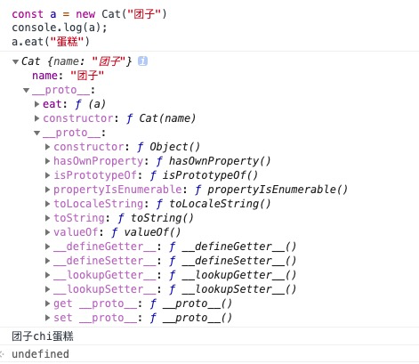
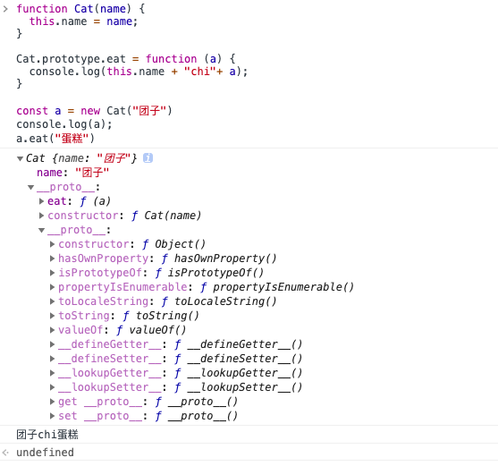

js 原型链

<https://developer.mozilla.org/zh-CN/docs/Web/JavaScript/Inheritance_and_the_prototype_chain>

```
JavaScript 只有一种结构：对象。每个实例对象（ object ）都有一个私有属性（称之为 __proto__ ）指向它的构造函数的原型对象（prototype ）。该原型对象也有一个自己的原型对象( __proto__ ) ，层层向上直到一个对象的原型对象为 null。根据定义，null 没有原型，并作为这个原型链中的最后一个环节。

几乎所有 JavaScript 中的对象都是位于原型链顶端的 Object 的实例。

尽管这种原型继承通常被认为是 JavaScript 的弱点之一，但是原型继承模型本身实际上比经典模型更强大。

```

```
在Javascript中，每个函数都有一个原型属性 prototype 指向自身的原型， 而由这个函数创建的对象也有一个__proto__ 属性指向这个原型，而函数的原型是一个对象，所以这个对象也会有一个__proto__指向自己的原型，这样逐层深入直到Object对象的原型，这样就形成了原型链.

函数的原型属性 prototype 只想自身原型 而自身原型的 constructor 指向这个函数

```







## [使用不同的方法来创建对象和生成原型链](https://developer.mozilla.org/zh-CN/docs/Web/JavaScript/Inheritance_and_the_prototype_chain#使用不同的方法来创建对象和生成原型链)

### [使用语法结构创建的对象](https://developer.mozilla.org/zh-CN/docs/Web/JavaScript/Inheritance_and_the_prototype_chain#使用语法结构创建的对象)

```js
var o = {a: 1};

// o 这个对象继承了 Object.prototype 上面的所有属性
// o 自身没有名为 hasOwnProperty 的属性
// hasOwnProperty 是 Object.prototype 的属性
// 因此 o 继承了 Object.prototype 的 hasOwnProperty
// Object.prototype 的原型为 null
// 原型链如下:
// o ---> Object.prototype ---> null

var a = ["yo", "whadup", "?"];

// 数组都继承于 Array.prototype
// (Array.prototype 中包含 indexOf, forEach 等方法)
// 原型链如下:
// a ---> Array.prototype ---> Object.prototype ---> null

function f(){
  return 2;
}

// 函数都继承于 Function.prototype
// (Function.prototype 中包含 call, bind等方法)
// 原型链如下:
// f ---> Function.prototype ---> Object.prototype ---> null
```

### [使用构造器创建的对象](https://developer.mozilla.org/zh-CN/docs/Web/JavaScript/Inheritance_and_the_prototype_chain#使用构造器创建的对象)

在 JavaScript 中，构造器其实就是一个普通的函数。当使用 [new 操作符](https://developer.mozilla.org/zh-CN/docs/Web/JavaScript/Reference/Operators/new) 来作用这个函数时，它就可以被称为构造方法（构造函数）。

new 关键字会进行如下的操作：

```js
创建一个空的简单JavaScript对象（即{}）；
链接该对象（设置该对象的constructor）到另一个对象 ；
将步骤1新创建的对象作为this的上下文 ；
如果该函数没有返回对象，则返回this。
（译注：关于对象的 constructor，参见 Object.prototype.constructor）

当代码 new Foo(...) 执行时，会发生以下事情：

一个继承自 Foo.prototype 的新对象被创建。
使用指定的参数调用构造函数 Foo，并将 this 绑定到新创建的对象。new Foo 等同于 new Foo()，也就是没有指定参数列表，Foo 不带任何参数调用的情况。
由构造函数返回的对象就是 new 表达式的结果。如果构造函数没有显式返回一个对象，则使用步骤1创建的对象。（一般情况下，构造函数不返回值，但是用户可以选择主动返回对象，来覆盖正常的对象创建步骤）
```

```
function Graph() {
  this.vertices = [];
  this.edges = [];
}

Graph.prototype = {
  addVertex: function(v){
    this.vertices.push(v);
  }
};

var g = new Graph();
// g 是生成的对象，他的自身属性有 'vertices' 和 'edges'。
// 在 g 被实例化时，g.[[Prototype]] 指向了 Graph.prototype。
```

### [使用 `Object.create` 创建的对象](https://developer.mozilla.org/zh-CN/docs/Web/JavaScript/Inheritance_and_the_prototype_chain#使用_object.create_创建的对象)

ECMAScript 5 中引入了一个新方法：[`Object.create()`](https://developer.mozilla.org/zh-CN/docs/Web/JavaScript/Reference/Global_Objects/Object/create)。可以调用这个方法来创建一个新对象。新对象的原型就是调用 create 方法时传入的第一个参数：

```
var a = {a: 1};
// a ---> Object.prototype ---> null

var b = Object.create(a);
// b ---> a ---> Object.prototype ---> null
console.log(b.a); // 1 (继承而来)

var c = Object.create(b);
// c ---> b ---> a ---> Object.prototype ---> null

var d = Object.create(null);
// d ---> null
console.log(d.hasOwnProperty); // undefined, 因为d没有继承Object.prototype
```

### [使用 `class` 关键字创建的对象](https://developer.mozilla.org/zh-CN/docs/Web/JavaScript/Inheritance_and_the_prototype_chain#使用_class_关键字创建的对象)

ECMAScript6 引入了一套新的关键字用来实现 [class](https://developer.mozilla.org/zh-CN/docs/Web/JavaScript/Reference/Classes)。使用基于类语言的开发人员会对这些结构感到熟悉，但它们是不同的。JavaScript 仍然基于原型。这些新的关键字包括 [`class`](https://developer.mozilla.org/zh-CN/docs/Web/JavaScript/Reference/Statements/class), [`constructor`](https://developer.mozilla.org/zh-CN/docs/Web/JavaScript/Reference/Classes/constructor)，[`static`](https://developer.mozilla.org/zh-CN/docs/Web/JavaScript/Reference/Classes/static)，[`extends`](https://developer.mozilla.org/zh-CN/docs/Web/JavaScript/Reference/Classes/extends) 和 [`super`](https://developer.mozilla.org/zh-CN/docs/Web/JavaScript/Reference/Operators/super)。

```js
class Super {
 constructor(width, height) {
  this.width = width;
    this.height = height;
  }
  get res() {
  return this.width * this.height;
  }
  // static
  //
}
class Suber extends Super {
 constructor(len) {
  super(len)
  }
}

const a = new Suber();

```
